# 401K Automation Integration Plan

## Overview

This document outlines the strategy and implementation plan for integrating 401K account automation into our platform. The goal is to provide users with a secure, compliant, and efficient way to manage their retirement accounts through our interface.

## System Architecture

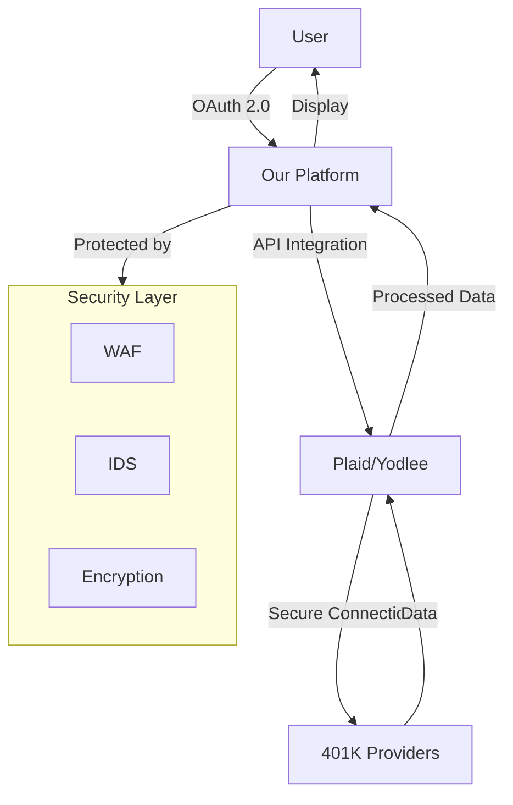

## Data Flow

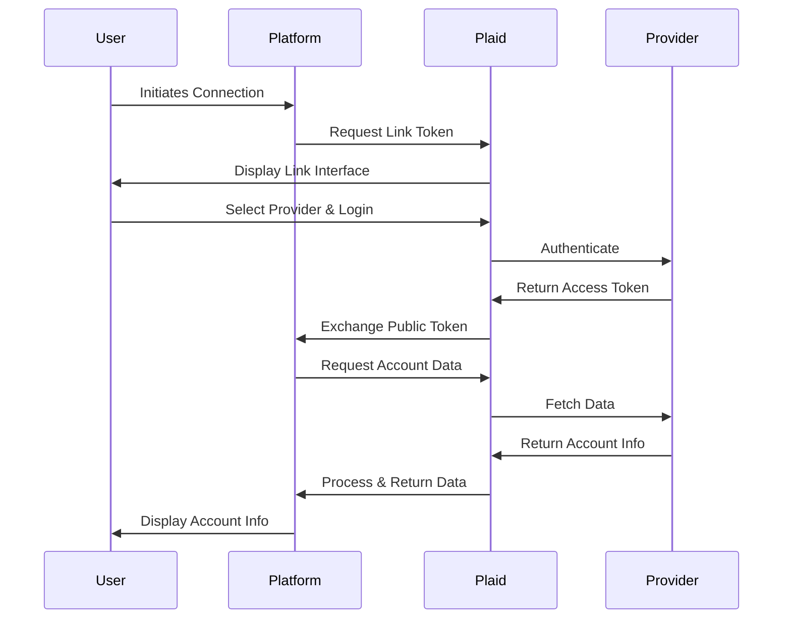

## Implementation Phases

### Phase 1: Foundation Setup
- Legal compliance framework
- Security infrastructure
- API integration setup
- Basic account viewing

### Phase 2: Core Features
- Account aggregation
- Portfolio analysis
- Basic automation rules
- Transaction history

### Phase 3: Advanced Features
- Automated rebalancing
- Tax optimization
- Investment recommendations
- Performance tracking

## Technical Considerations

### Security Measures
1. End-to-end encryption (TLS 1.3+)
2. Multi-factor authentication
3. Role-based access control
4. Audit logging
5. Regular security audits

### Compliance Requirements
1. GLBA compliance
2. SEC/FINRA regulations
3. Data privacy laws (CCPA/GDPR)
4. Financial institution terms of service

## Risk Assessment

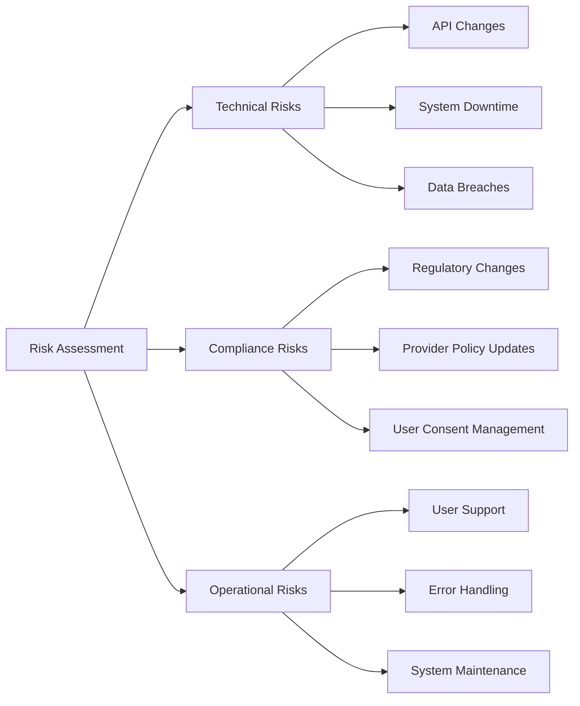

## Additional Insights

### Market Opportunities
1. **Personalization**: AI-driven investment recommendations based on user behavior and market trends
2. **Integration**: Potential to expand to other financial products (IRAs, HSAs)
3. **Analytics**: Advanced portfolio analytics and reporting
4. **Education**: Financial literacy tools and resources

### Technical Challenges
1. **Provider Diversity**: Different 401K providers have varying API capabilities
2. **Real-time Updates**: Ensuring accurate, up-to-date account information
3. **Error Handling**: Managing various failure scenarios gracefully
4. **Scalability**: Handling increasing user base and data volume

### Future Considerations
1. **Blockchain Integration**: Potential for secure, transparent transaction records
2. **AI/ML**: Advanced pattern recognition for investment opportunities
3. **Mobile Optimization**: Enhanced mobile experience for on-the-go management
4. **API Ecosystem**: Building an open platform for third-party integrations

## Implementation Timeline

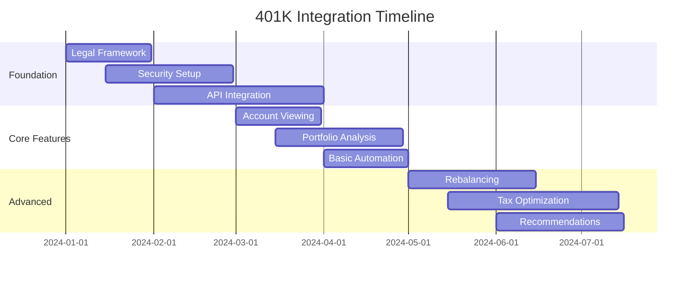

## Success Metrics

1. **User Adoption**
   - Number of connected accounts
   - Active user rate
   - Feature usage statistics

2. **Technical Performance**
   - API response times
   - Error rates
   - System uptime

3. **Business Impact**
   - User retention
   - Feature engagement
   - Customer satisfaction

## Next Steps

1. **Immediate Actions**
   - Finalize legal documentation
   - Set up development environment
   - Begin API integration testing

2. **Short-term Goals**
   - Complete MVP development
   - Conduct security audit
   - Launch beta testing

3. **Long-term Vision**
   - Expand provider network
   - Develop advanced features
   - Scale infrastructure

## Conclusion

The 401K automation integration presents significant opportunities for enhancing user financial management while requiring careful consideration of security, compliance, and technical challenges. Success will depend on robust implementation, continuous monitoring, and adaptive development based on user feedback and market changes.

## UX Design & Mockups

### 401K to Startup Investment Flow

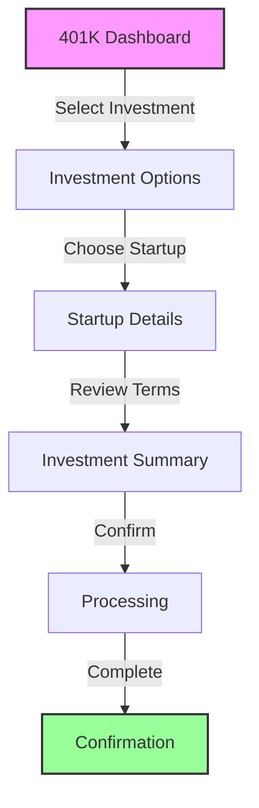

### Key Screens

1. **401K Dashboard**
   ```
   +------------------------------------------+
   | 401K Investment Portal                   |
   +------------------------------------------+
   | Account Balance: $250,000                |
   | Available for Investment: $50,000        |
   +------------------------------------------+
   | Investment Options                       |
   | [ ] Traditional Funds                    |
   | [x] Startup Investments                  |
   | [ ] Real Estate                          |
   +------------------------------------------+
   | Quick Actions                            |
   | [View Portfolio] [Start Investment]      |
   +------------------------------------------+
   ```

2. **Startup Investment Selection**
   ```
   +------------------------------------------+
   | Available Startups                       |
   +------------------------------------------+
   | [Search Startups...]                     |
   +------------------------------------------+
   | TechStart AI                             |
   | $500K raised / $2M goal                  |
   | [View Details] [Invest]                  |
   +------------------------------------------+
   | GreenEnergy Solutions                    |
   | $1.2M raised / $3M goal                  |
   | [View Details] [Invest]                  |
   +------------------------------------------+
   ```

3. **Investment Summary**
   ```
   +------------------------------------------+
   | Investment Summary                       |
   +------------------------------------------+
   | Startup: TechStart AI                    |
   | Investment Amount: $25,000               |
   | Equity: 1.25%                            |
   | Estimated Return: 3-5x                   |
   +------------------------------------------+
   | [Edit Amount] [Proceed to Review]        |
   +------------------------------------------+
   ```

4. **Confirmation Screen**
   ```
   +------------------------------------------+
   | Investment Confirmed                     |
   +------------------------------------------+
   | ✓ Transaction Complete                   |
   | Investment ID: INV-2024-001              |
   | Amount: $25,000                          |
   | Date: 2024-03-15                         |
   +------------------------------------------+
   | [View Portfolio] [Download Receipt]      |
   +------------------------------------------+
   ```

### User Flow Considerations

1. **Simplified Navigation**
   - Clear progress indicators
   - Back/forward navigation
   - Save draft functionality
   - Quick access to help/resources

2. **Information Architecture**
   - Hierarchical display of investment options
   - Clear categorization of startups
   - Prominent display of key metrics
   - Easy access to detailed information

3. **Mobile Responsiveness**
   - Optimized for touch interfaces
   - Collapsible sections
   - Swipe gestures for navigation
   - Responsive data tables

4. **Accessibility Features**
   - High contrast mode
   - Screen reader compatibility
   - Keyboard navigation
   - Clear error messages

### Design System

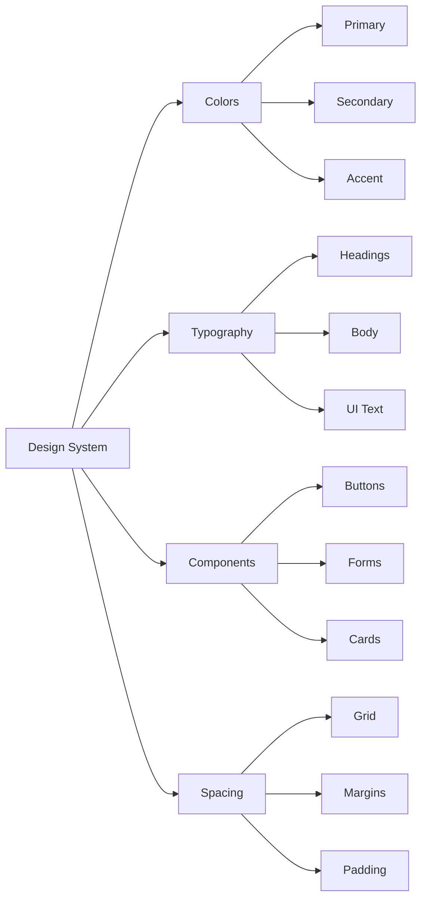

### Interactive Elements

1. **Investment Slider**
   - Visual representation of investment amount
   - Real-time equity calculation
   - Minimum/maximum limits
   - Quick preset amounts

2. **Portfolio Visualization**
   - Pie chart of investments
   - Performance metrics
   - Risk indicators
   - Historical data

3. **Startup Cards**
   - Key metrics
   - Progress bars
   - Quick actions
   - Status indicators

### Error States & Loading

1. **Loading States**
   - Skeleton screens
   - Progress indicators
   - Loading animations
   - Placeholder content

2. **Error Handling**
   - Clear error messages
   - Recovery options
   - Help resources
   - Contact support

### Analytics Integration

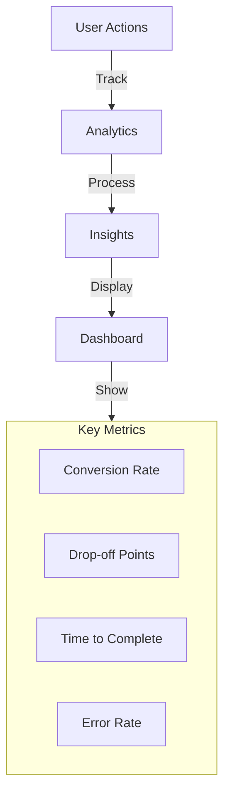

## Alternative Implementation: Puppeteer Automation

### Overview
For providers like Fidelity that don't offer direct APIs, we'll implement a secure browser automation solution using Puppeteer.

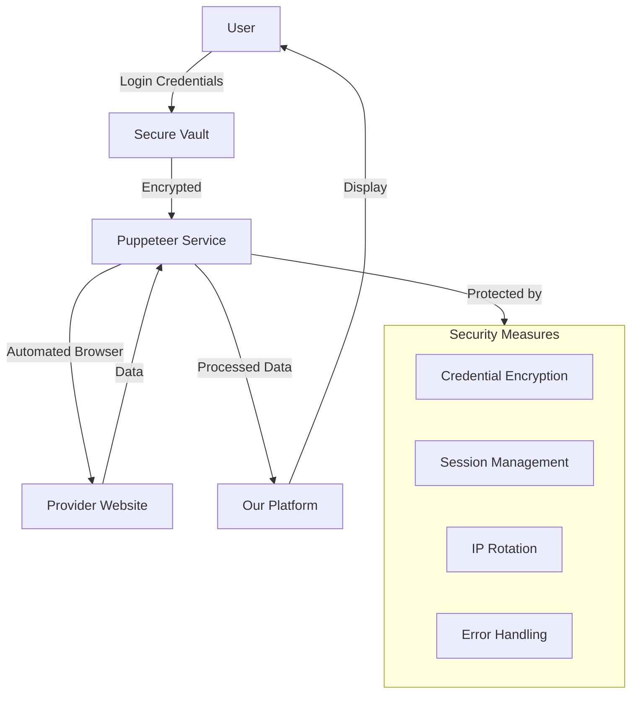

### Implementation Details

1. **Puppeteer Service Setup**
```typescript
// Example Puppeteer implementation
import puppeteer from 'puppeteer';

class FidelityAutomation {
  private browser: Browser;
  private page: Page;

  async initialize() {
    this.browser = await puppeteer.launch({
      headless: true,
      args: ['--no-sandbox', '--disable-setuid-sandbox']
    });
    this.page = await this.browser.newPage();
  }

  async login(credentials: SecureCredentials) {
    await this.page.goto('https://www.fidelity.com');
    await this.page.type('#username', credentials.username);
    await this.page.type('#password', credentials.password);
    await this.page.click('#login-button');
    await this.page.waitForNavigation();
  }

  async getAccountBalance() {
    // Navigate to account page
    await this.page.goto('https://www.fidelity.com/account');
    // Extract balance information
    const balance = await this.page.evaluate(() => {
      return document.querySelector('.balance-amount').textContent;
    });
    return balance;
  }

  async executeInvestment(amount: number, fundId: string) {
    // Navigate to investment page
    await this.page.goto('https://www.fidelity.com/invest');
    // Fill investment form
    await this.page.type('#amount', amount.toString());
    await this.page.select('#fund-select', fundId);
    // Submit and confirm
    await this.page.click('#submit-investment');
    await this.page.waitForSelector('.confirmation-message');
  }
}
```

2. **Security Measures**
   - Credential encryption at rest
   - Secure session management
   - IP rotation to prevent blocking
   - Error handling and retry mechanisms
   - Audit logging

3. **Error Handling**
```typescript
class AutomationError extends Error {
  constructor(
    public type: 'LOGIN_FAILED' | 'NAVIGATION_ERROR' | 'TIMEOUT',
    public details: any
  ) {
    super(`Automation error: ${type}`);
  }
}

async function handleAutomationError(error: AutomationError) {
  switch (error.type) {
    case 'LOGIN_FAILED':
      // Notify user, request re-authentication
      break;
    case 'NAVIGATION_ERROR':
      // Retry with exponential backoff
      break;
    case 'TIMEOUT':
      // Refresh session, retry operation
      break;
  }
}
```

4. **Session Management**
```typescript
class SessionManager {
  private sessions: Map<string, Session> = new Map();

  async createSession(userId: string): Promise<Session> {
    const session = new Session(userId);
    await session.initialize();
    this.sessions.set(userId, session);
    return session;
  }

  async refreshSession(userId: string) {
    const session = this.sessions.get(userId);
    if (session) {
      await session.refresh();
    }
  }
}
```

### Provider-Specific Implementations

1. **Fidelity**
   - Login flow
   - Account balance retrieval
   - Investment execution
   - Transaction history

2. **Vanguard**
   - Login flow
   - Portfolio management
   - Investment options
   - Performance tracking

3. **Charles Schwab**
   - Login flow
   - Account overview
   - Investment management
   - Transaction processing

### Monitoring and Maintenance

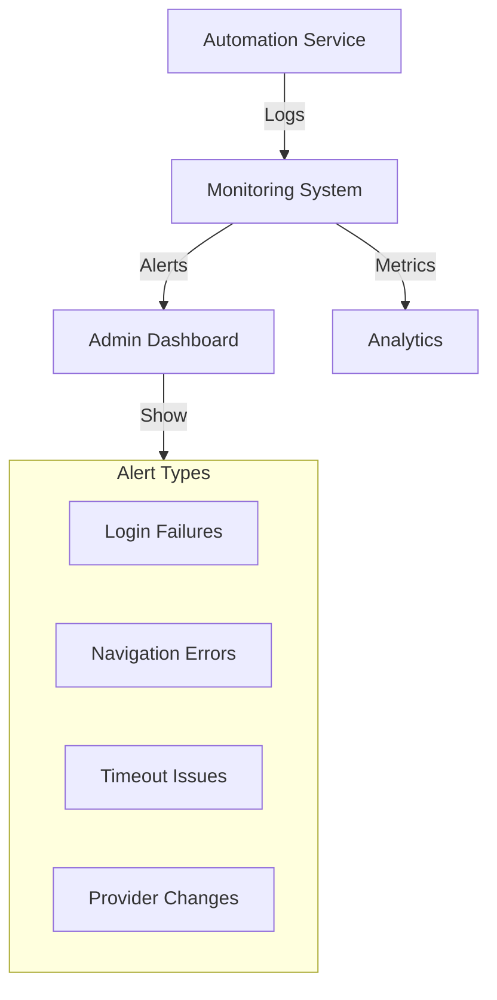

### Best Practices

1. **Rate Limiting**
   - Implement delays between actions
   - Respect provider's terms of service
   - Use exponential backoff for retries

2. **Error Recovery**
   - Automatic session refresh
   - Fallback mechanisms
   - User notification system

3. **Data Validation**
   - Verify successful operations
   - Cross-check balances
   - Transaction confirmation

4. **Compliance**
   - Document all automated actions
   - Maintain audit trails
   - Regular security reviews

### Implementation Timeline

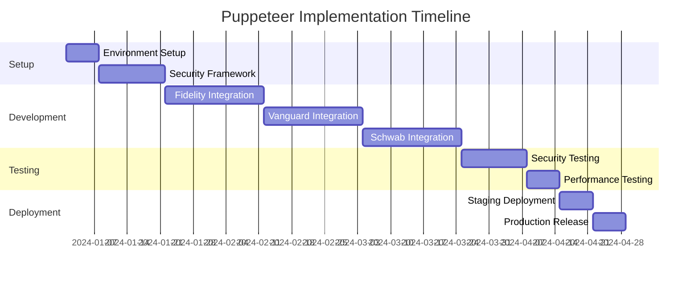

## Security Measures

### 1. Credential Management

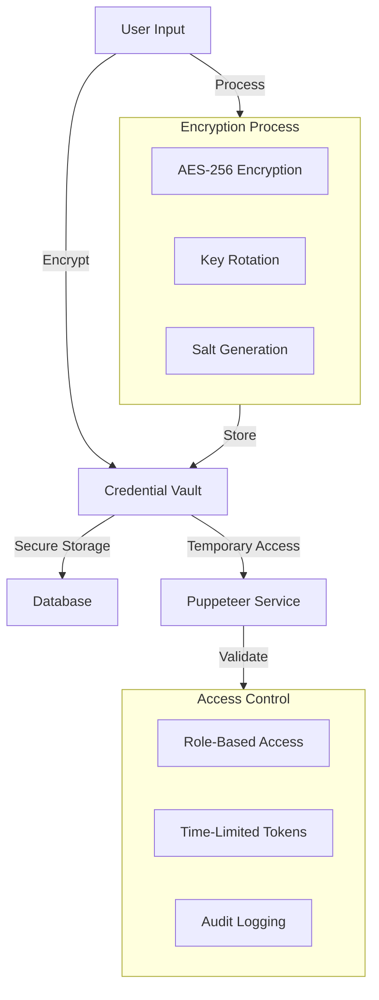

### 2. Session Management

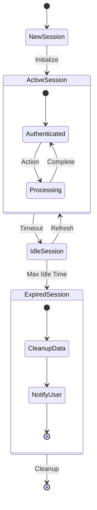

### 3. IP Rotation & Anti-Detection

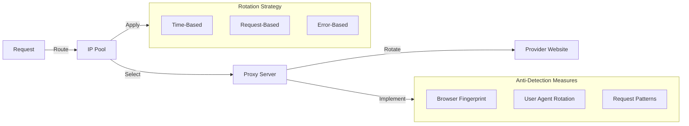

### 4. Error Handling & Recovery

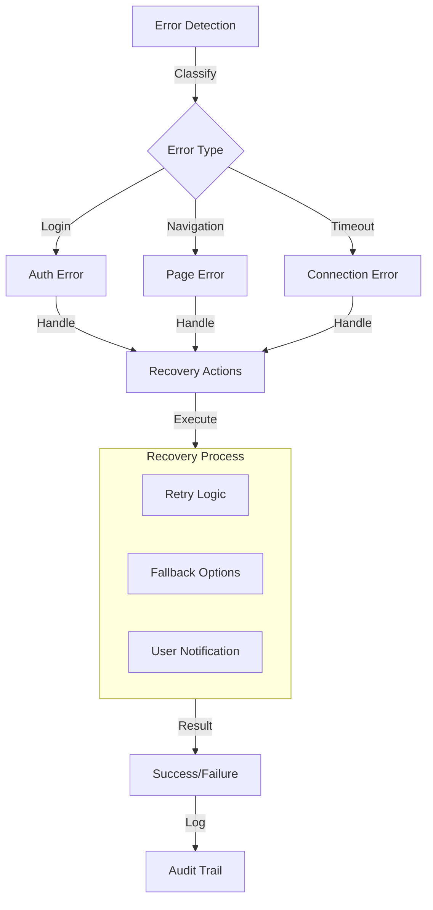

### 5. Audit & Compliance

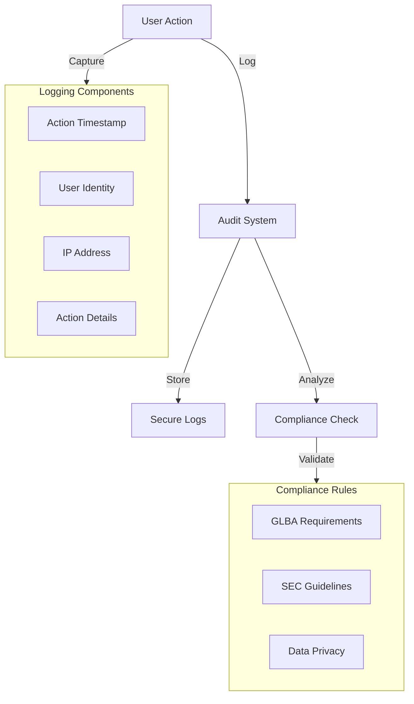

### 6. Data Protection

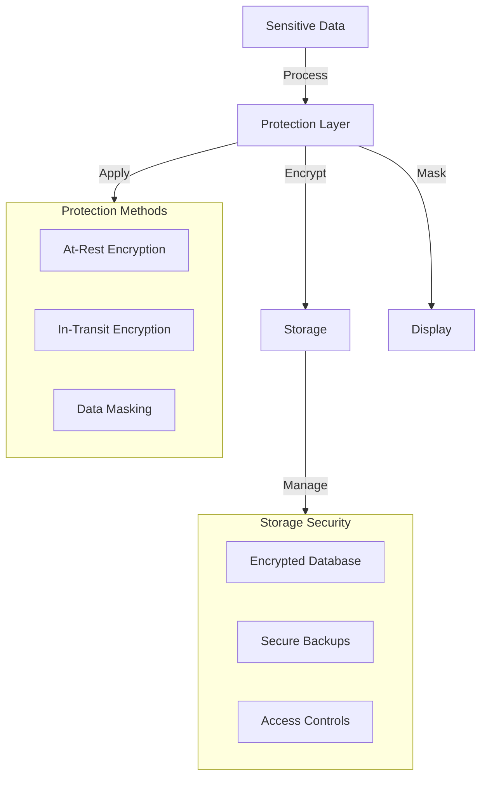

### 7. Monitoring & Alerting

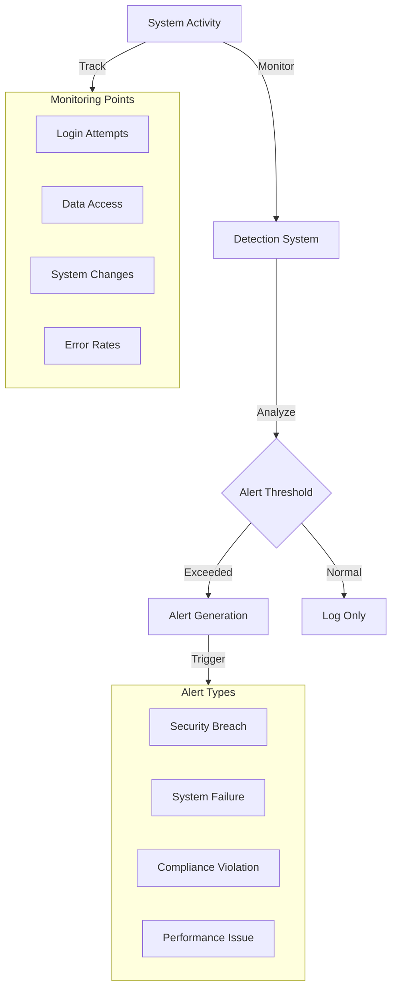

### 8. Access Control

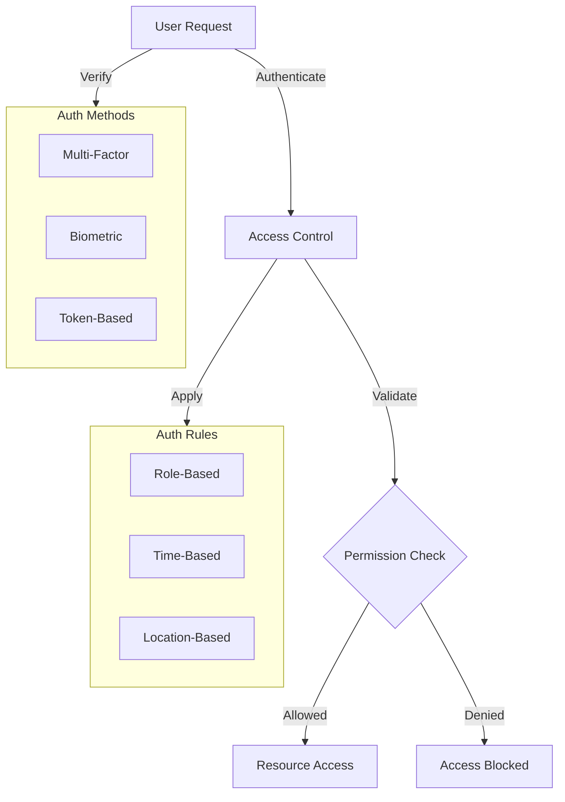

### Implementation Priority

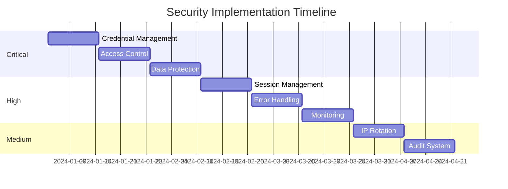

## Direct Partnership with Fidelity

### Overview
A direct partnership with Fidelity offers a compliant, robust, and scalable way to enable early 401K extraction for startup investment. This approach involves formal business development, legal agreements, and technical integration, potentially via private APIs or co-branded solutions.

### Steps to Partnership
1. Prepare a business case showing mutual benefits (user growth, fee revenue, innovation).
2. Contact Fidelity via their [business partnership channels](https://www.fidelity.com/about-fidelity/contact-us).
3. Undergo due diligence, security, and compliance review.
4. Integrate technically via Fidelity's preferred method (API, SSO, data feed, etc.).

### Interest Alignment & Conflict of Interest Analysis

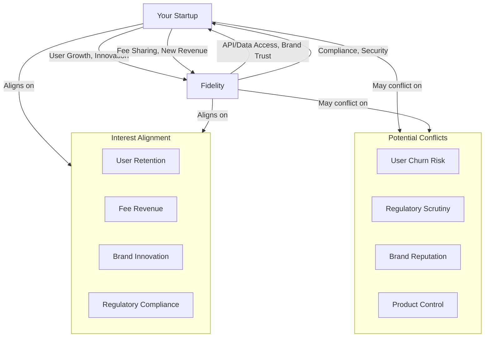

### Pros & Cons
| Approach             | Compliance | User Experience | Speed to Market | Risk      |
|----------------------|------------|-----------------|-----------------|-----------|
| Puppeteer/Scrape     | Low        | Medium          | Fast            | High      |
| Direct Partnership   | High       | High            | Slow            | Low       |
| Aggregator API       | High       | High            | Medium          | Low-Med   |

### Why Fidelity Might Be Interested
- **User Retention:** Innovative withdrawal/investment options keep users from rolling over to competitors.
- **Fee Revenue:** Earn fees from early withdrawal or investment transactions.
- **Brand Innovation:** Enhance image as an innovator by partnering with fintechs.
- **Regulatory Compliance:** All activity is above board and auditable.

### Next Steps
- Prepare a business and technical pitch deck.
- Reach out to Fidelity's business development or institutional partnership team.
- Consider legal counsel for partnership agreements.

### References
- [Fidelity Contact Page](https://www.fidelity.com/about-fidelity/contact-us)
- [Fidelity Institutional](https://institutional.fidelity.com/app/home.shtml)

## Amplifying Alignment & Mitigating Conflict (Fidelity Partnership)

### 1. Alignment: User Retention
```mermaid
graph TD
    A[User Retention]
    A --> B[Offer Exclusive Investment Options]
    A --> C[Seamless User Experience]
    A --> D[Personalized Financial Advice]
    B --> E[Early 401K Extraction for Startups]
    C --> F[Single Sign-On, Fast Transfers]
    D --> G[AI-Driven Recommendations]
```
**Amplify:**
- Co-develop exclusive products (e.g., startup investment funds).
- Integrate SSO and fast transfer APIs.
- Use AI to personalize retention offers.

---

### 2. Alignment: Fee Revenue
```mermaid
graph TD
    A[Fee Revenue]
    A --> B[Transaction Fees]
    A --> C[Premium Services]
    A --> D[Revenue Sharing]
    B --> E[Early Withdrawal Fees]
    C --> F[Advisory/Management Fees]
    D --> G[Joint Marketing Campaigns]
```
**Amplify:**
- Structure revenue sharing on new products.
- Bundle premium advisory services.
- Run joint marketing to boost volume.

---

### 3. Alignment: Brand Innovation
```mermaid
graph TD
    A[Brand Innovation]
    A --> B[Co-Branded Solutions]
    A --> C[Fintech PR Campaigns]
    A --> D[Beta Launches]
    B --> E[Joint Product Branding]
    C --> F[Media Coverage]
    D --> G[Invite-Only Pilots]
```
**Amplify:**
- Launch co-branded products.
- Collaborate on PR and media.
- Run exclusive beta programs.

---

### 4. Alignment: Regulatory Compliance
```mermaid
graph TD
    A[Regulatory Compliance]
    A --> B[Joint Compliance Audits]
    A --> C[Shared Legal Resources]
    A --> D[Transparent Reporting]
    B --> E[Regular Security Reviews]
    C --> F[Legal Counsel Collaboration]
    D --> G[Real-Time Audit Trails]
```
**Amplify:**
- Schedule joint audits and reviews.
- Share legal and compliance resources.
- Build transparent, real-time reporting.

---

### 5. Conflict: User Churn Risk
```mermaid
graph TD
    A[User Churn Risk]
    A --> B[Mitigation: Loyalty Programs]
    A --> C[Mitigation: Exit Surveys]
    A --> D[Mitigation: Retention Offers]
    B --> E[Reward Long-Term Users]
    C --> F[Collect Feedback]
    D --> G[Personalized Retention Deals]
```
**Mitigate:**
- Launch loyalty and rewards.
- Use exit surveys to learn and adapt.
- Offer personalized retention incentives.

---

### 6. Conflict: Regulatory Scrutiny
```mermaid
graph TD
    A[Regulatory Scrutiny]
    A --> B[Mitigation: Proactive Disclosure]
    A --> C[Mitigation: Legal Review]
    A --> D[Mitigation: Regulator Engagement]
    B --> E[Transparent Communication]
    C --> F[Ongoing Legal Counsel]
    D --> G[Early Regulator Meetings]
```
**Mitigate:**
- Proactively disclose new features.
- Maintain ongoing legal review.
- Engage with regulators early.

---

### 7. Conflict: Brand Reputation
```mermaid
graph TD
    A[Brand Reputation]
    A --> B[Mitigation: Joint PR Strategy]
    A --> C[Mitigation: Crisis Plan]
    A --> D[Mitigation: Customer Support]
    B --> E[Unified Messaging]
    C --> F[Rapid Response Team]
    D --> G[24/7 Support Channels]
```
**Mitigate:**
- Develop joint PR and crisis plans.
- Set up rapid response teams.
- Ensure robust customer support.

---

### 8. Conflict: Product Control
```mermaid
graph TD
    A[Product Control]
    A --> B[Mitigation: Clear SLAs]
    A --> C[Mitigation: Governance Board]
    A --> D[Mitigation: Roadmap Alignment]
    B --> E[Define Responsibilities]
    C --> F[Joint Decision-Making]
    D --> G[Regular Roadmap Syncs]
```
**Mitigate:**
- Define clear service-level agreements.
- Set up a joint governance board.
- Align product roadmaps regularly.

## Regulatory & Practical Context: 401(k) Withdrawals

According to [Investopedia](https://www.investopedia.com/ask/answers/101314/how-do-you-withdraw-money-your-401k.asp), early 401(k) withdrawals (before age 59½) are possible but typically incur a 10% penalty and income tax, unless the withdrawal qualifies for specific IRS exceptions (e.g., medical bills, disaster recovery, hardship, etc.). Plan rules may be stricter than IRS rules, so employer and provider policies must be checked. Alternatives include 401(k) loans and SEPP (Substantially Equal Periodic Payments).

**Key Implications:**
- Any business model must educate users about penalties, taxes, and exceptions.
- Automated solutions should help users identify qualifying exceptions and alternatives.
- Partnerships with providers like Fidelity can help ensure compliance and user support.

## Potential Benefits for All Parties

| Stakeholder | Potential Benefits |
|-------------|-------------------|
| **Withdrawer** | - Access to liquidity for emergencies or investment<br>- Automated guidance on penalty-free options<br>- Streamlined withdrawal/loan process<br>- Education on long-term impact |
| **Fidelity** | - Increased user engagement<br>- Fee revenue from withdrawals/loans<br>- Enhanced brand as a user-centric innovator<br>- Reduced support burden via automation |
| **Our Startup** | - Revenue from platform/service fees<br>- Data insights on user needs<br>- Brand as a trusted financial facilitator<br>- Potential for cross-selling investment products |

## Business Idea: 401(k) Smart Extraction & Investment Platform

**Concept:**
A platform that helps users unlock their 401(k) for qualified needs or investment, with:
- Automated eligibility checks for penalty-free withdrawals
- Guidance on loans vs. withdrawals
- Direct investment options (e.g., startup investing)
- Education on tax/penalty impact and long-term growth
- Seamless integration with providers (via partnership or automation)

**Features:**
- Smart withdrawal/loan wizard
- Exception/penalty calculator
- Real-time provider integration
- Investment marketplace (startups, funds, etc.)
- Compliance and audit trail

## Ecosystem Analysis

```mermaid
graph TD
    A[Withdrawer]
    B[Fidelity]
    C[Our Startup]
    D[IRS/Regulators]
    E[Startup Investment Marketplace]
    F[Employers/Plan Sponsors]

    A -- Requests Withdrawal/Loan --> C
    C -- Eligibility Check, Guidance --> A
    C -- API/Automation --> B
    B -- Approves/Processes --> C
    C -- Compliance Reporting --> D
    B -- Compliance Reporting --> D
    C -- Offers Investment Options --> E
    A -- Invests in Startups --> E
    F -- Sets Plan Rules --> B
    C -- Employer Education/Integration --> F

    subgraph ValueFlows[Value Flows]
        V1[Fee Revenue]
        V2[User Data]
        V3[Brand Value]
        V4[Compliance]
    end
    C -- Shares Data/Insights --> V2
    B -- Gains Brand Value --> V3
    A -- Pays Fees --> V1
    C -- Ensures Compliance --> V4
    B -- Ensures Compliance --> V4
```

**Summary:**
- The platform acts as a bridge, ensuring compliance, user education, and value creation for all parties.
- By automating eligibility and integrating investment options, it can reduce friction and increase engagement.
- Regulatory compliance and user education are critical for trust and sustainability.

**Reference:**
- [Investopedia: How to Make an Early Withdrawal From Your 401(k)](https://www.investopedia.com/ask/answers/101314/how-do-you-withdraw-money-your-401k.asp)
