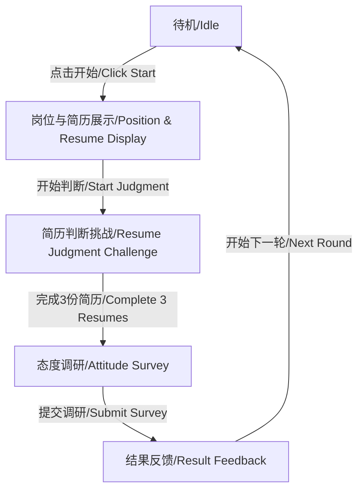
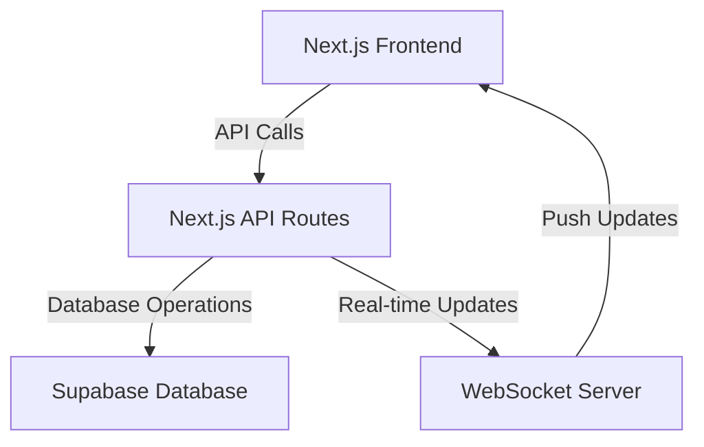
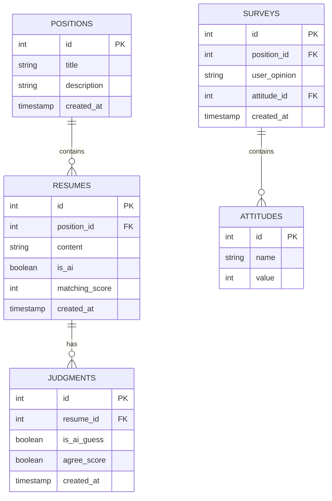
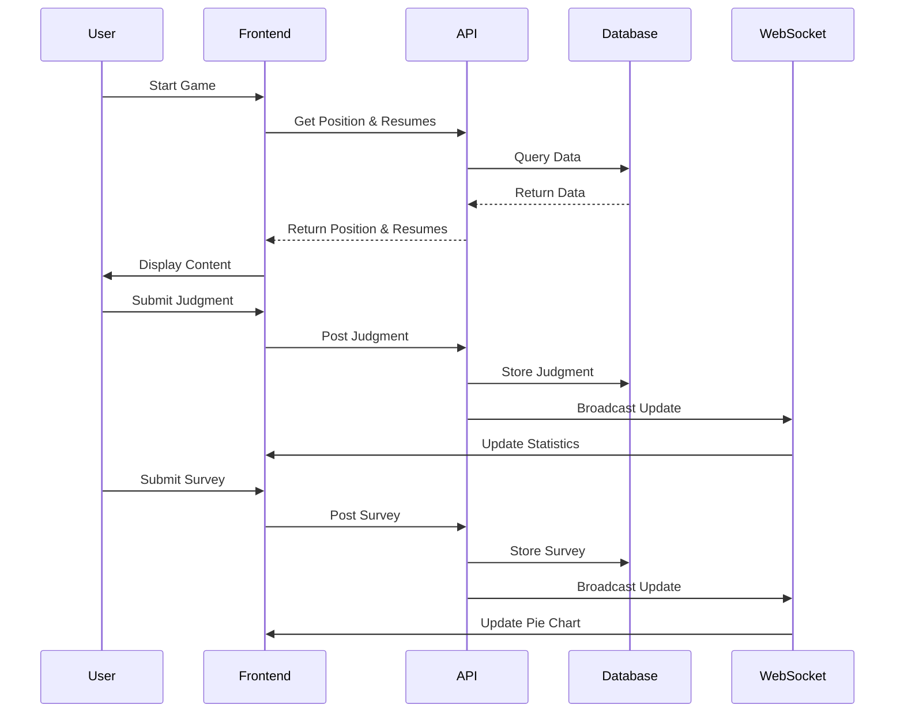
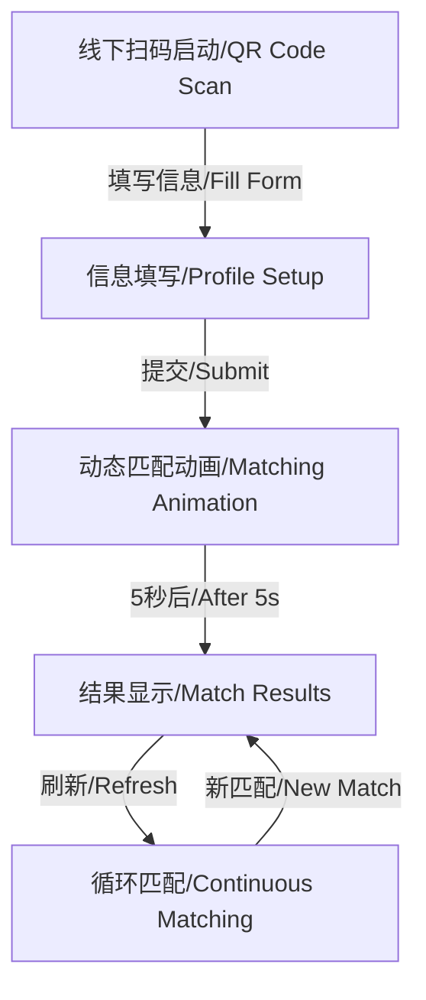
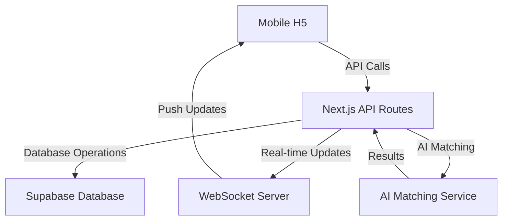
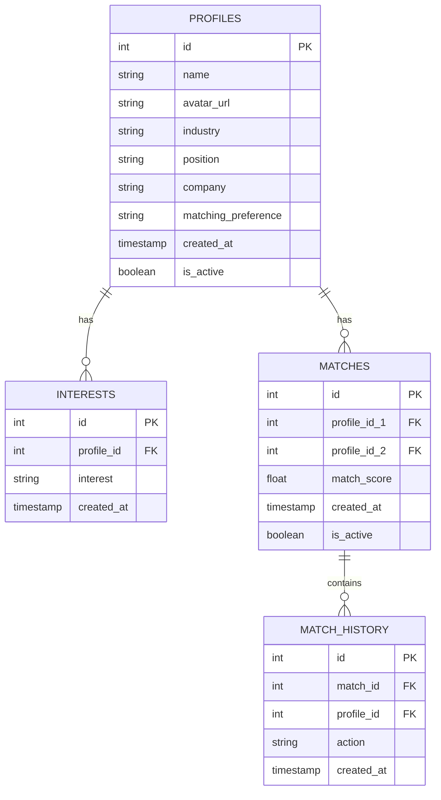
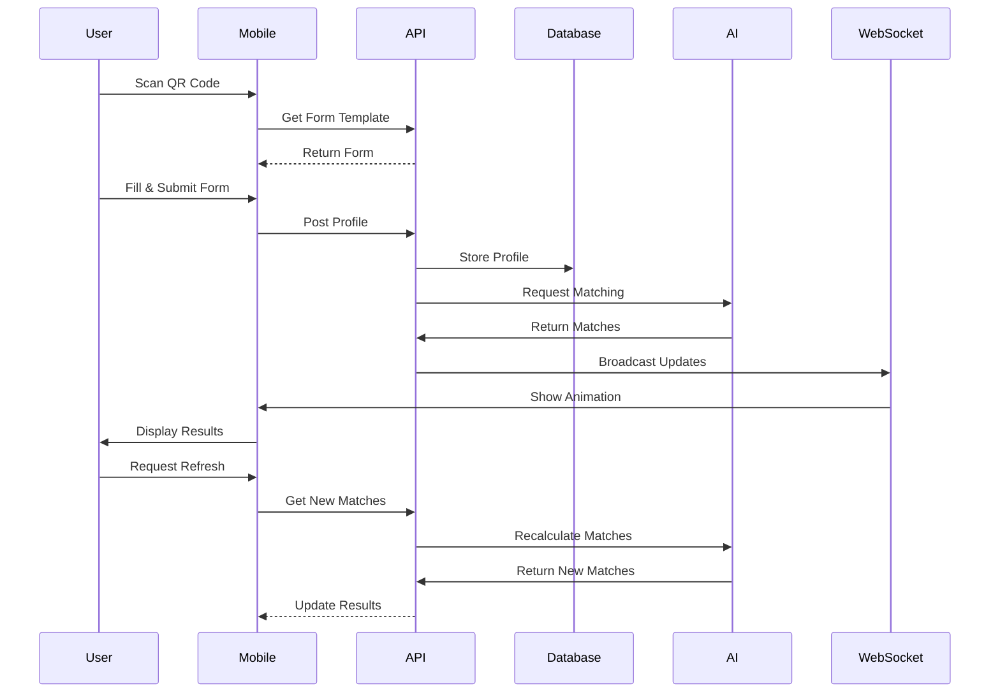

# 真假CV (True/False CV) - AI Resume Recognition Challenge

An interactive game that challenges users to identify AI-generated resumes and share their opinions on AI usage in job applications.

## Game Flow



## System Architecture



## Database Schema (Supabase)



## Features

### 1. 待机 (Idle) Stage
- Displays a pie chart showing current survey results
- Shows distribution of attitudes towards AI usage in resumes
- Interactive start button to begin the game

### 2. 岗位与简历展示 (Position & Resume Display)
- Shows current position title and job description
- Displays 3 resumes sequentially
- Each resume shows AI matching score
- Mix of AI-generated and human-written resumes

### 3. 简历判断挑战 (Resume Judgment Challenge)
- Two questions per resume:
  1. Is this resume AI-generated? (Yes/No)
  2. Do you agree with the AI matching score? (Yes/No)
- Progress tracking through 3 resumes

### 4. 态度调研 (Attitude Survey)
- 5-point scale question:
  - 强烈反对 (Strongly Against)
  - 反对 (Against)
  - 中立 (Neutral)
  - 支持 (Support)
  - 强烈支持 (Strongly Support)
- Optional text field for additional comments

### 5. 结果反馈 (Result Feedback)
- Real-time updated pie chart
- Shows current distribution of attitudes
- Visual representation of survey results

### 6. 轮换重启 (Rotation Restart)
- Automatic position rotation
- Three positions in rotation:
  1. 高级前端开发工程师 (Senior Frontend Developer)
  2. 产品经理 (Product Manager)
  3. UI设计师 (UI Designer)

## Technical Stack

- **Frontend**: Next.js 15, React 19, TypeScript
- **UI Components**: shadcn/ui, Tailwind CSS
- **Data Visualization**: Recharts
- **Database**: Supabase
- **Real-time Updates**: WebSocket
- **State Management**: React Context API

## API Endpoints

```typescript
// API Routes
POST /api/games/true-false-cv/judgments
POST /api/games/true-false-cv/surveys
GET /api/games/true-false-cv/statistics
GET /api/games/true-false-cv/positions
GET /api/games/true-false-cv/resumes
```

## Data Flow



## Setup Instructions

1. Clone the repository
2. Install dependencies:
   ```bash
   pnpm install
   ```
3. Set up environment variables:
   ```env
   NEXT_PUBLIC_SUPABASE_URL=your_supabase_url
   NEXT_PUBLIC_SUPABASE_ANON_KEY=your_supabase_anon_key
   ```
4. Run the development server:
   ```bash
   pnpm dev
   ```

## Database Setup (Supabase)

1. Create a new Supabase project
2. Run the following SQL to set up the database:

```sql
-- Create tables
CREATE TABLE positions (
    id SERIAL PRIMARY KEY,
    title TEXT NOT NULL,
    description TEXT NOT NULL,
    created_at TIMESTAMP WITH TIME ZONE DEFAULT CURRENT_TIMESTAMP
);

CREATE TABLE resumes (
    id SERIAL PRIMARY KEY,
    position_id INTEGER REFERENCES positions(id),
    content TEXT NOT NULL,
    is_ai BOOLEAN NOT NULL,
    matching_score INTEGER NOT NULL,
    created_at TIMESTAMP WITH TIME ZONE DEFAULT CURRENT_TIMESTAMP
);

CREATE TABLE judgments (
    id SERIAL PRIMARY KEY,
    resume_id INTEGER REFERENCES resumes(id),
    is_ai_guess BOOLEAN NOT NULL,
    agree_score BOOLEAN NOT NULL,
    created_at TIMESTAMP WITH TIME ZONE DEFAULT CURRENT_TIMESTAMP
);

CREATE TABLE attitudes (
    id SERIAL PRIMARY KEY,
    name TEXT NOT NULL,
    value INTEGER NOT NULL
);

CREATE TABLE surveys (
    id SERIAL PRIMARY KEY,
    position_id INTEGER REFERENCES positions(id),
    user_opinion TEXT,
    attitude_id INTEGER REFERENCES attitudes(id),
    created_at TIMESTAMP WITH TIME ZONE DEFAULT CURRENT_TIMESTAMP
);

-- Insert initial attitudes
INSERT INTO attitudes (name, value) VALUES
    ('强烈反对', 1),
    ('反对', 2),
    ('中立', 3),
    ('支持', 4),
    ('强烈支持', 5);
```

## Contributing

1. Fork the repository
2. Create your feature branch (`git checkout -b feature/amazing-feature`)
3. Commit your changes (`git commit -m 'Add some amazing feature'`)
4. Push to the branch (`git push origin feature/amazing-feature`)
5. Open a Pull Request

## License

This project is licensed under the MIT License - see the [LICENSE](LICENSE) file for details.

# AI Social Matching Game

An interactive social matching game that uses AI to connect participants based on their profiles and preferences.

## Game Flow



## System Architecture



## Database Schema (Supabase)



## Features

### 1. 线下扫码启动 (QR Code Activation)
- Standee with QR code
- Title: "认识新朋友，一起玩点新鲜的！"
- Description: "扫码填写信息，体验AI智能配对"
- CTA: "立即参与！"

### 2. 信息填写 (Profile Setup)
- Mobile H5 form with fields:
  1. Name
  2. Avatar upload
  3. Interests (multi-select)
  4. Matching preferences:
     - Same industry
     - Cross-industry
     - Random

### 3. 动态匹配动画 (Matching Animation)
- 5-second full-screen animation
- Floating avatars with connection lines
- "AI 匹配中..." text prompt
- Real-time visualization of matching process

### 4. 结果显示 (Match Results)
- Best match display:
  1. Name + Avatar
  2. Position + Company
- Match score percentage
- Common interests highlight

### 5. 循环匹配 (Continuous Matching)
- "刷新查看新匹配" button
- Real-time updates
- Cached form data
- New matches on refresh

## Technical Stack

- **Frontend**: Next.js 15, React 19, TypeScript
- **Mobile**: Responsive H5 with PWA support
- **UI Components**: shadcn/ui, Tailwind CSS
- **Animation**: Framer Motion
- **Database**: Supabase
- **Real-time Updates**: WebSocket
- **AI Matching**: Custom matching algorithm
- **File Storage**: Supabase Storage for avatars

## API Endpoints

```typescript
// API Routes
POST /api/games/social-matching/profiles
GET /api/games/social-matching/matches
POST /api/games/social-matching/refresh
GET /api/games/social-matching/status
POST /api/games/social-matching/upload-avatar
```

## Data Flow



## Database Setup (Supabase)

```sql
-- Create tables
CREATE TABLE profiles (
    id SERIAL PRIMARY KEY,
    name TEXT NOT NULL,
    avatar_url TEXT,
    industry TEXT,
    position TEXT,
    company TEXT,
    matching_preference TEXT NOT NULL,
    created_at TIMESTAMP WITH TIME ZONE DEFAULT CURRENT_TIMESTAMP,
    is_active BOOLEAN DEFAULT true
);

CREATE TABLE interests (
    id SERIAL PRIMARY KEY,
    profile_id INTEGER REFERENCES profiles(id),
    interest TEXT NOT NULL,
    created_at TIMESTAMP WITH TIME ZONE DEFAULT CURRENT_TIMESTAMP
);

CREATE TABLE matches (
    id SERIAL PRIMARY KEY,
    profile_id_1 INTEGER REFERENCES profiles(id),
    profile_id_2 INTEGER REFERENCES profiles(id),
    match_score FLOAT NOT NULL,
    created_at TIMESTAMP WITH TIME ZONE DEFAULT CURRENT_TIMESTAMP,
    is_active BOOLEAN DEFAULT true
);

CREATE TABLE match_history (
    id SERIAL PRIMARY KEY,
    match_id INTEGER REFERENCES matches(id),
    profile_id INTEGER REFERENCES profiles(id),
    action TEXT NOT NULL,
    created_at TIMESTAMP WITH TIME ZONE DEFAULT CURRENT_TIMESTAMP
);

-- Create indexes
CREATE INDEX idx_profiles_industry ON profiles(industry);
CREATE INDEX idx_profiles_is_active ON profiles(is_active);
CREATE INDEX idx_matches_is_active ON matches(is_active);
```

## AI Matching Algorithm

The matching algorithm considers multiple factors:

1. **Industry Compatibility**
   - Same industry: +30 points
   - Related industry: +20 points
   - Different industry: +10 points

2. **Interest Overlap**
   - Each common interest: +10 points
   - Maximum 50 points

3. **Position Level**
   - Similar level: +20 points
   - Different level: +10 points

4. **Matching Preference**
   - Aligns with preference: +20 points
   - Doesn't align: +0 points

Total score is normalized to a percentage (0-100%).

## Setup Instructions

1. Follow the main project setup instructions
2. Set up additional environment variables:
   ```env
   NEXT_PUBLIC_MATCHING_ALGORITHM_VERSION=1.0
   NEXT_PUBLIC_MAX_MATCHES_PER_REFRESH=5
   NEXT_PUBLIC_ANIMATION_DURATION=5000
   ```
3. Configure Supabase Storage for avatar uploads
4. Set up WebSocket server for real-time updates

## Contributing

Same as main project contributing guidelines.

## License

Same as main project license. 